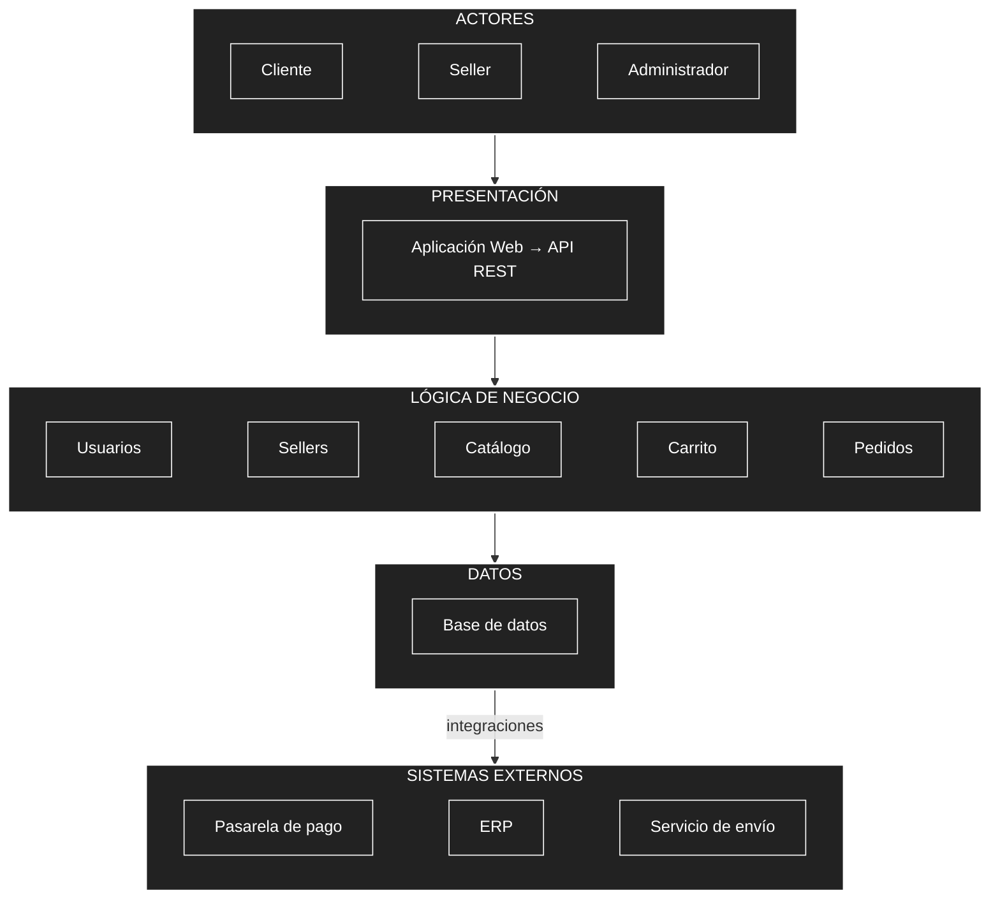
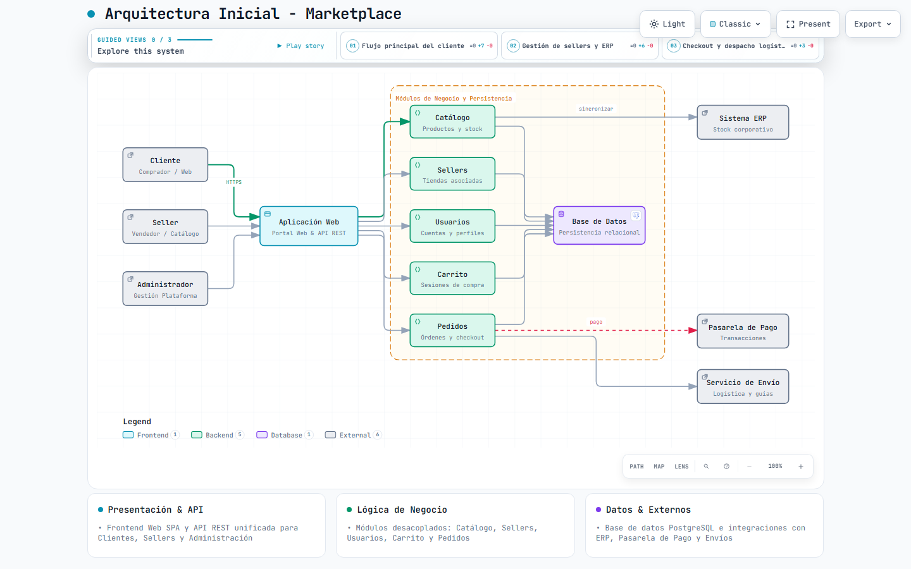
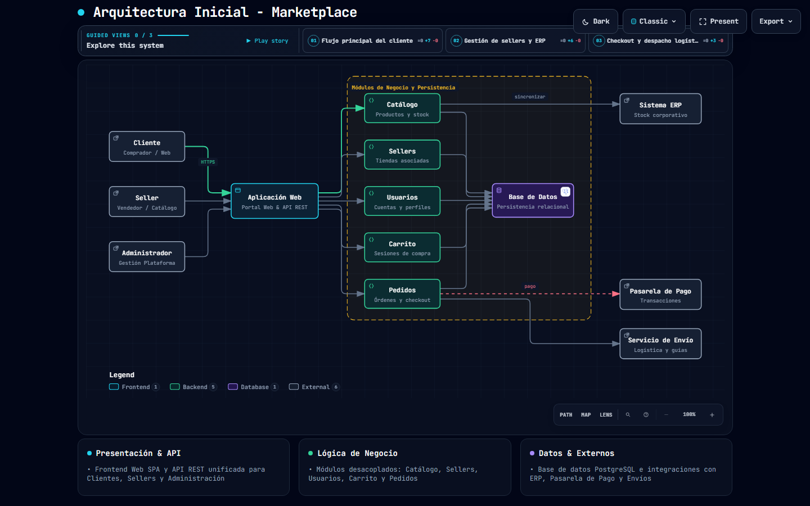

# Arquitectura inicial del sistema

## Diagrama de arquitectura



## Descripción
La arquitectura inicial se organiza en tres capas principales:
- **Presentación:** permite la interacción de los usuarios con el sistema mediante la aplicación web y la API REST.
- **Lógica de negocio:** contiene los principales módulos responsables de las funcionalidades del sistema: catálogo, sellers, usuarios, carrito y pedidos.
- **Datos:** permite almacenar y consultar la información mediante una base de datos relacional (PostgreSQL).

Además, el sistema se integra con servicios externos:
- **Pasarela de pago:** procesamiento de transacciones de compra desde el módulo de pedidos.
- **Servicio de envío:** coordinación de despacho y guías de seguimiento logístico.
- **Sistema ERP:** sincronización corporativa de catálogo e inventario de productos.

---

## Diagrama Interactivo de Arquitectura (Archify)

Se ha integrado el agente **Archify** para generar un diagrama de arquitectura interactivo, responsive y exportable en formato HTML independiente con SVG vectorial.

- **Visor interactivo HTML:** [arquitectura-inicial.html](./arquitectura-inicial.html)
- **Especificación técnica JSON:** [arquitectura-inicial.json](./arquitectura-inicial.json)
- **Reporte de validación visual:** [arquitectura-inicial.visual-check.html](./arquitectura-inicial.visual-check.html)

### Vista previa del diagrama

#### Modo Claro


#### Modo Oscuro


### Capacidades interactivas disponibles en el visor
1. **Vistas guiadas (*Guided Views*):**
   - **Flujo principal del cliente:** Resalta el recorrido del comprador desde la consulta de catálogo, carrito y checkout hasta el pago.
   - **Gestión de sellers y ERP:** Aísla la operación comercial y sincronización con el ERP empresarial.
   - **Checkout y despacho logístico:** Enfocado en la pasarela de pago y logística de envíos.
2. **Modo Claro / Oscuro dinámico:** Conmutación instantánea de paleta preservando el contraste tipográfico y semántico.
3. **Inspección y trazado de rutas:** Enfoque en componentes individuales con trazado de dependencias entrantes y salientes.
4. **Exportación de alta fidelidad:** Descarga directa en formatos PNG, SVG, WebP y WebM.
5. **Navegación y Zoom:** Pan/Zoom con modos Path, Map y Lens adaptables a cualquier resolución de pantalla.

### Comandos de gestión y validación
```bash
# Validar especificación de arquitectura con perfil showcase (9 controles de calidad)
node .agents/skills/archify/bin/archify.mjs validate architecture arquitectura/arquitectura-inicial.json --quality showcase --json

# Generar y compilar la versión distribuible del visor HTML
node .agents/skills/archify/bin/archify.mjs deliver architecture arquitectura/arquitectura-inicial.json arquitectura/arquitectura-inicial.html --quality showcase --json

# Ejecutar verificación visual en múltiples resoluciones de escritorio
node .agents/skills/archify/bin/archify.mjs visual-check arquitectura/arquitectura-inicial.html --json
```

