# Enfoque Arquitectónico: Clean Architecture

Este documento define el patrón y enfoque arquitectónico adoptado para la aplicación cliente del marketplace (**Marketplace Web** en Angular 18 con TypeScript), estableciendo el control de dependencias internas mediante **Clean Architecture (Arquitectura Limpia)**.

---

## 1. Definición del Patrón / Enfoque Arquitectónico

| Elemento | Descripción aplicada al Marketplace |
|---|---|
| **Patrón / enfoque arquitectónico** | Clean Architecture (Arquitectura Limpia). |
| **Objetivo** | Separar responsabilidades y controlar las dependencias hacia el dominio. |
| **¿Qué problema resuelve?** | Evita el acoplamiento entre la interfaz Angular, las reglas del negocio y las tecnologías externas, como bases de datos, API y servicios de pago. |
| **Capas definidas** | Presentación, Aplicación, Dominio e Infraestructura. |
| **Beneficios** | • Facilita el mantenimiento y las pruebas unitarias. • Permite cambiar implementaciones técnicas sin modificar innecesariamente las reglas del negocio. • Mejora la organización y separación de responsabilidades del código. |

---

## 2. Diagrama de Clean Architecture en Marketplace Web

```mermaid
flowchart LR

%% =========================================================
%% CLEAN ARCHITECTURE - MARKETPLACE WEB
%% Coherente con la arquitectura detallada del proyecto
%% =========================================================

%% -------------------------
%% ACTOR
%% -------------------------
User["👤 Usuario<br/><i>Cliente</i>"]

%% =========================================================
%% MARKETPLACE WEB
%% =========================================================
subgraph APP["«aplicación» Marketplace Web — Angular 18 · TypeScript"]

    direction LR

    %% -------------------------
    %% PRESENTACIÓN
    %% -------------------------
    subgraph PRESENTACION["PRESENTACIÓN<br/>src/app/presentacion/"]
        direction TB

        Catalogo["«componente»<br/><b>CatalogoComponent</b>"]
        Estado["«servicio de estado»<br/><b>EstadoCarrito</b>"]
        Carrito["«componente»<br/><b>CarritoComponent</b>"]
        AppComp["«componente»<br/><b>AppComponent</b>"]
    end

    %% -------------------------
    %% APLICACIÓN
    %% -------------------------
    subgraph APLICACION["APLICACIÓN<br/>src/app/aplicacion/"]
        direction TB

        Consultar["«caso de uso»<br/><b>ConsultarCatalogoCasoUso</b>"]
        Agregar["«caso de uso»<br/><b>AgregarAlCarritoCasoUso</b>"]
        Registrar["«caso de uso»<br/><b>RegistrarCompraCasoUso</b>"]
    end

    %% -------------------------
    %% DOMINIO
    %% -------------------------
    subgraph DOMINIO["DOMINIO — NÚCLEO<br/>src/app/dominio/"]
        direction TB

        subgraph ENTIDADES["Entidades y reglas"]
            Producto["«entidad»<br/><b>Producto</b>"]
            CarritoDom["«entidad»<br/><b>Carrito</b>"]
            Pedido["«entidad»<br/><b>Pedido</b>"]
            Precios["«reglas»<br/><b>precios.ts</b>"]
        end

        subgraph CONTRATOS["Contratos / Puertos"]
            RepoProductos["«interface»<br/><b>RepositorioProductos</b>"]
            RepoPedidos["«interface»<br/><b>RepositorioPedidos</b>"]
            ProcesadorPagos["«interface»<br/><b>ProcesadorPagos</b>"]
            Notificador["«interface»<br/><b>NotificadorCliente</b>"]
        end
    end

    %% -------------------------
    %% INFRAESTRUCTURA
    %% -------------------------
    subgraph INFRA["INFRAESTRUCTURA<br/>src/app/infraestructura/"]
        direction TB

        RepoAdapter["«adaptador»<br/><b>Repositorios</b><br/>Memoria · HTTP"]

        PagoAdapter["«adaptador»<br/><b>Procesadores de pago</b><br/>Simulado · Niubiz"]

        NotifAdapter["«adaptador»<br/><b>Notificadores</b><br/>Consola · WhatsApp"]

        DI["«Angular DI»<br/><b>tokens.ts</b>"]
    end

end

%% =========================================================
%% SISTEMA EXTERNO
%% =========================================================

subgraph EXTERNO["SISTEMA EXTERNO"]
    API["«API REST»<br/><b>Marketplace API</b><br/>Backend Node.js<br/><br/>/api/productos<br/>/api/pedidos<br/>/api/authorization<br/>/api/mensajes"]
end

%% =========================================================
%% FLUJO PRINCIPAL
%% =========================================================

User -->|"interactúa"| PRESENTACION

PRESENTACION -->|"invoca"| APLICACION

APLICACION -->|"utiliza entidades<br/>y contratos"| DOMINIO

%% =========================================================
%% INVERSIÓN DE DEPENDENCIAS
%% Infraestructura depende de abstracciones del dominio
%% =========================================================

INFRA -.->|"implementa<br/>contratos"| DOMINIO

%% =========================================================
%% COMUNICACIÓN EXTERNA
%% =========================================================

INFRA -->|"HTTP / JSON"| API

%% =========================================================
%% ESTILOS
%% =========================================================

style APP fill:#f8f8f8,stroke:#555555,stroke-width:2px

style PRESENTACION fill:#dcecff,stroke:#4f8edc,stroke-width:2px
style APLICACION fill:#e5f4df,stroke:#67a95b,stroke-width:2px
style DOMINIO fill:#fff1c9,stroke:#e3a72f,stroke-width:3px
style INFRA fill:#eee1f6,stroke:#9b64bd,stroke-width:2px
style EXTERNO fill:#eeeeee,stroke:#666666,stroke-width:2px

style Catalogo fill:#ffffff,stroke:#4f8edc
style Estado fill:#ffffff,stroke:#4f8edc
style Carrito fill:#ffffff,stroke:#4f8edc
style AppComp fill:#ffffff,stroke:#4f8edc

style Consultar fill:#ffffff,stroke:#67a95b
style Agregar fill:#ffffff,stroke:#67a95b
style Registrar fill:#ffffff,stroke:#67a95b

style Producto fill:#ffffff,stroke:#e3a72f
style CarritoDom fill:#ffffff,stroke:#e3a72f
style Pedido fill:#ffffff,stroke:#e3a72f
style Precios fill:#ffffff,stroke:#e3a72f

style RepoProductos fill:#ffffff,stroke:#e3a72f
style RepoPedidos fill:#ffffff,stroke:#e3a72f
style ProcesadorPagos fill:#ffffff,stroke:#e3a72f
style Notificador fill:#ffffff,stroke:#e3a72f

style RepoAdapter fill:#ffffff,stroke:#9b64bd
style PagoAdapter fill:#ffffff,stroke:#9b64bd
style NotifAdapter fill:#ffffff,stroke:#9b64bd
style DI fill:#ffffff,stroke:#9b64bd

style API fill:#ffffff,stroke:#666666
```

## 3. Descripción de las Capas de la Arquitectura

### 3.1. Capa de Dominio (`src/app/dominio/`)
Es el **núcleo central del sistema** y contiene la lógica de negocio pura:
- **TypeScript puro e independiente:** No posee dependencias de Angular, `@angular/core`, `HttpClient`, ni `RxJS`. Esto permite que todas las reglas de negocio puedan ser validadas y probadas en milisegundos sin requerir un navegador (`npm run pruebas`).
- **Modelos y Entidades:**
  - `Producto`: Atributos de producto, stock disponible, categoría y precios.
  - `Carrito`: Modelo inmutable para cálculo de subtotal y total.
  - `Pedido`: Ciclo de vida del pedido, estados y reglas de cancelación.
  - `precios.ts`: Funciones puras con las políticas de precios (comisión del marketplace del 10% e IGV del 18%).
- **Contratos (Puertos):** Interfaces de TypeScript que definen los métodos requeridos sin conocer la implementación:
  - `RepositorioProductos`
  - `RepositorioPedidos`
  - `ProcesadorPagos`
  - `NotificadorCliente`

### 3.2. Capa de Aplicación (`src/app/aplicacion/`)
Orquesta los flujos de casos de uso del sistema coordinando las entidades del dominio y los contratos definidos:
- `ConsultarCatalogoCasoUso`: Filtra y recupera productos mediante el contrato `RepositorioProductos`.
- `AgregarAlCarritoCasoUso`: Aplica validaciones de stock y añade productos al estado del carrito.
- `RegistrarCompraCasoUso`: Ejecuta el flujo completo de checkout (creación de pedido, procesamiento de pago con `ProcesadorPagos` y envío de confirmación con `NotificadorCliente`).

### 3.3. Capa de Presentación (`src/app/presentacion/`)
Responsable exclusivamente de la interfaz de usuario en Angular 18:
- `CatalogoComponent`: Vista de listado, búsqueda y filtrado de productos.
- `CarritoComponent`: Resumen visual de ítems seleccionados y botón de confirmación de compra.
- `EstadoCarrito`: Servicio reactivo basado en Angular **Signals** para gestión de estado en memoria del carrito (sin reglas de negocio).
- `AppComponent`: Shell principal contenedor de la aplicación.

### 3.4. Capa de Infraestructura (`src/app/infraestructura/`)
Implementa los puertos/contratos del dominio mediante adaptadores tecnológicos concretos:
- **Adaptadores de Repositorio:**
  - `RepositorioProductosHttp` / `RepositorioPedidosHttp`: Consumo de la API REST externa vía `HttpClient`.
  - `RepositorioProductosMemoria` / `RepositorioPedidosMemoria`: Implementaciones en memoria para desarrollo local rápido y pruebas automatizadas offline.
- **Adaptadores de Pagos y Notificaciones:**
  - `ProcesadorPagosSimulado` y `ProcesadorPagosNiubiz`.
  - `NotificadorConsola` y `NotificadorWhatsApp`.
- **Inyección de Dependencias:**
  - `tokens.ts`: Define los `InjectionToken` correspondientes a cada interfaz/contrato para permitir la inversión de control en Angular.

### 3.5. Raíz de Composición (`app.config.ts`)
Es el **único punto de la aplicación** donde se realiza el acoplamiento técnico:
- Utiliza proveedores con `useFactory` vinculando cada `InjectionToken` con su adaptador correspondiente (por ejemplo, alternar entre `RepositorioProductosHttp` o `RepositorioProductosMemoria`).
- Permite cambiar completamente la infraestructura técnica o simular servicios de terceros sin alterar una sola línea del dominio ni de los casos de uso.

### 3.6. Sistema Externo: Backend Marketplace API REST
Monolito modular Node.js que expone los servicios a través de HTTPS/JSON:
- Endpoints: `/api/productos`, `/api/pedidos`, `/api/authorization`, `/api/mensajes`.
- La pasarela de pagos oficial (Niubiz) y el gateway de mensajería (WhatsApp) viven detrás de esta API para mantener seguras las credenciales y llaves privadas.

---

## 4. Reglas de Dependencia

1. **Aislamiento absoluto del dominio:** El dominio no importa nada de las capas externas (ni de Aplicación, ni de Presentación, ni de Infraestructura, ni de librerías del framework).
2. **Conocimiento restringido en Casos de Uso:** Los casos de uso solo conocen entidades de dominio y contratos (interfaces), nunca implementaciones concretas.
3. **Intercambiabilidad de adaptadores:** Los adaptadores implementan contratos; por lo tanto, pueden ser sustituidos en cualquier momento sin riesgo de regresión funcional.
4. **Cambio tecnológico localizado:** Cambiar de tecnología o proveedor externo consiste únicamente en actualizar `app.config.ts` y proveer un nuevo adaptador en infraestructura, sin modificar el código de negocio.
