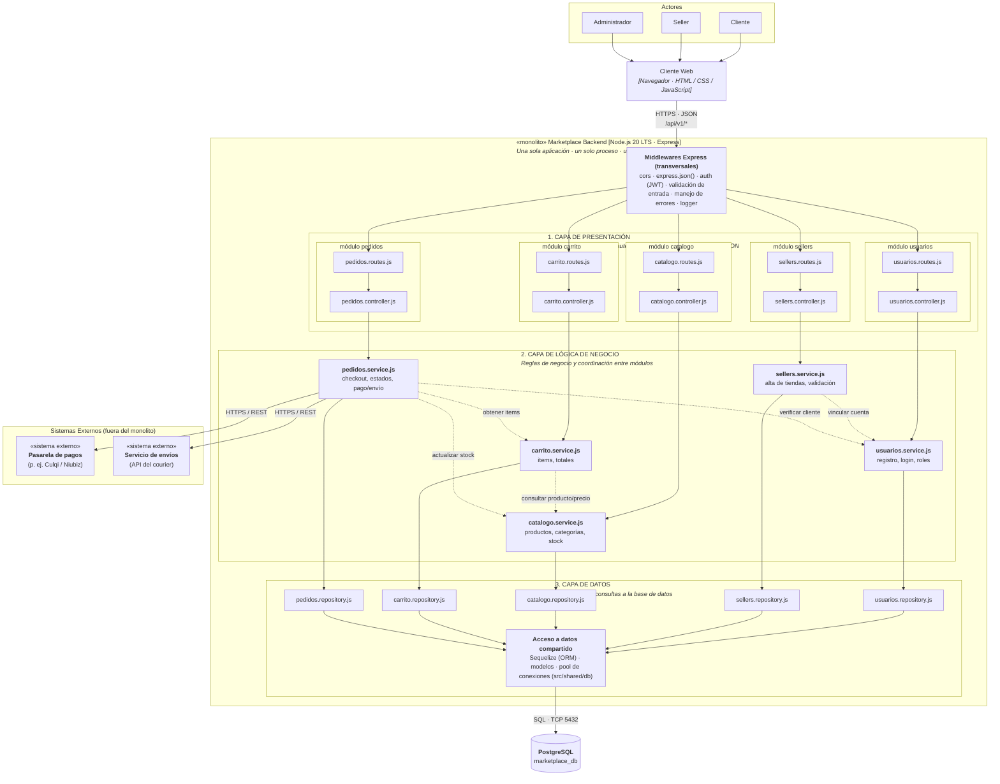

# Estilo Arquitectónico del Sistema

Este documento describe el **estilo arquitectónico seleccionado** para el sistema Marketplace de productos para mascotas, fundamentado en los requerimientos funcionales, atributos de calidad (escalabilidad, mantenibilidad, rendimiento y seguridad) y las decisiones arquitectónicas previas (ADR).

---

## 1. Estilo Arquitectónico Seleccionado: Monolito Modular en Capas

El estilo arquitectónico adoptado es un **Monolito Modular (*Modular Monolith*) estructurado en Capas (*Layered / N-Tier Architecture*) con principios de Clean Architecture**, implementado bajo el entorno de ejecución **Node.js 20 LTS** y el framework **Express.js**.

### Características clave del estilo:
- **Una sola aplicación, un solo proceso, un solo despliegue:** Simplifica drásticamente el desarrollo, pruebas, CI/CD y despliegue inicial en comparación con arquitecturas distribuidas complejas (microservicios).
- **Alta cohesión y modularidad funcional:** La lógica del sistema se divide estrictamente por módulos de dominio (`usuarios`, `sellers`, `catalogo`, `carrito`, `pedidos`) dentro de la estructura de carpetas `src/modules/<módulo>/`.
- **Bajo acoplamiento intermodular:** Un módulo nunca accede a los datos o persistencia de otro módulo; cualquier interacción se realiza exclusivamente a nivel de la capa de servicios (`.service.js`).
- **Separación de responsabilidades en 3 capas:**
  1. **Capa de Presentación:** Enrutamiento, controladores, autenticación y serialización JSON.
  2. **Capa de Lógica de Negocio:** Reglas de negocio, orquestación y coordinación entre dominios.
  3. **Capa de Datos:** Abstracción de acceso a datos mediante repositorios y Sequelize ORM hacia PostgreSQL.

---

## 2. Diagrama de Arquitectura del Sistema

---

## 3. Descripción de Componentes del Sistema

### 3.1. Actores y Cliente Web
- **Actores:** Comprenden el **Cliente** (comprador final), el **Seller** (vendedor/tienda aliada) y el **Administrador** de la plataforma.
- **Cliente Web:** Aplicación de interfaz de usuario ejecutada en navegador (HTML5, CSS3, JavaScript / SPA) que interactúa con el backend consumiendo endpoints seguros vía **HTTPS · JSON (`/api/v1/*`)**.

### 3.2. Middlewares Transversales (*Cross-Cutting Concerns*)
Filtros globales y de pipeline en Express que procesan cada solicitud HTTP antes de que llegue a las rutas de dominio:
- `cors`: Control de origen cruzado para acceso seguro desde el cliente web.
- `express.json()`: Parsing automatizado de cargas útiles JSON entrantes.
- `auth (JWT)`: Autenticación mediante tokens de sesión y autorización por roles.
- `validación de entrada`: Sanitización y validación de esquemas (ej. Joi o Zod).
- `manejo de errores`: Middleware centralizado para captura de excepciones y respuestas HTTP homogéneas.
- `logger`: Auditoría y registro de trazabilidad de peticiones.

### 3.3. Capas Internas del Monolito
| Capa | Responsabilidad | Componentes |
|---|---|---|
| **1. Capa de Presentación** | Recepción de peticiones HTTP, validación estructural, autenticación y serialización de respuestas en formato JSON. | `*.routes.js`: Definición de endpoints y aplicación de middlewares. `*.controller.js`: Coordinación de entrada/salida HTTP y llamado al servicio correspondiente. |
| **2. Capa de Lógica de Negocio** | Implementación pura de casos de uso, reglas de negocio y orquestación entre módulos funcionales. | `*.service.js`: Lógica de dominio para usuarios, sellers, catálogo, carrito y checkout de pedidos. |
| **3. Capa de Datos** | Abstracción de persistencia, operaciones CRUD y construcción de consultas a la base de datos. | `*.repository.js`: Repositorios aislados por cada módulo. `src/shared/db`: Conexión compartida mediante **Sequelize (ORM)**, definición de modelos relacionales y pool de conexiones. |

### 3.4. Integraciones con Sistemas Externos
- **Pasarela de Pagos (p. ej. Culqi / Niubiz):** Invocada por `pedidos.service.js` mediante adaptadores HTTPS/REST para autorizaciones y cobros en tiempo de compra.
- **Servicio de Envíos (API del courier):** Invocada por `pedidos.service.js` para generación de guías logísticas, cálculo de tarifas y seguimiento de despacho.

### 3.5. Base de Datos
- **PostgreSQL (`marketplace_db`):** Motor relacional que garantiza integridad transaccional (ACID), conectado mediante TCP en el puerto por defecto `5432`.

---

## 4. Reglas de la Arquitectura

Para asegurar la mantenibilidad a largo plazo y evitar la degeneración del monolito en un sistema caótico (*Big Ball of Mud*), se establecen las siguientes reglas estrictas:

1. **Invocación jerárquica estricta:** Cada capa solo puede invocar a la capa inmediatamente inferior (`Routes` $\rightarrow$ `Controller` $\rightarrow$ `Service` $\rightarrow$ `Repository` $\rightarrow$ `ORM/DB`).
2. **Aislamiento de persistencia:** Un módulo **nunca** accede al repositorio ni a las tablas de la base de datos de otro módulo.
3. **Comunicación intermodular controlada:** Cuando un módulo requiere información o acciones de otro dominio (por ejemplo, el módulo de pedidos consultando el catálogo o el carrito), la comunicación se realiza exclusivamente invocando al `*.service.js` del módulo destino.
4. **Ejecución y persistencia unificadas:** Todo el backend se ejecuta en un único proceso Node.js administrando una única base de datos centralizada.
